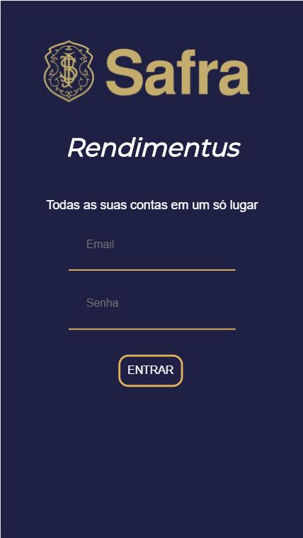
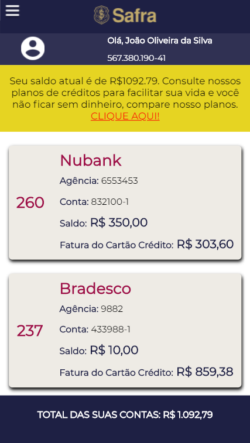
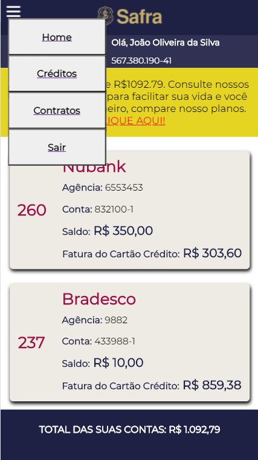
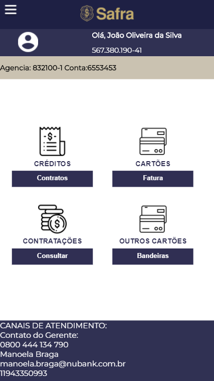
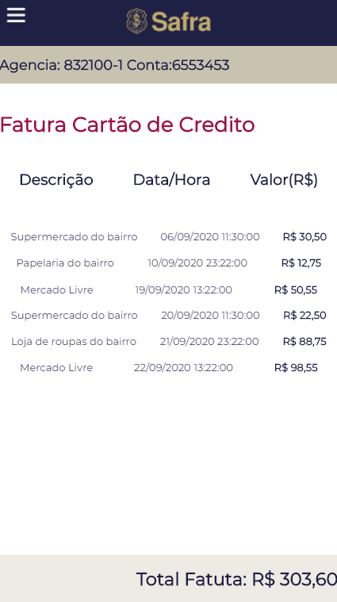
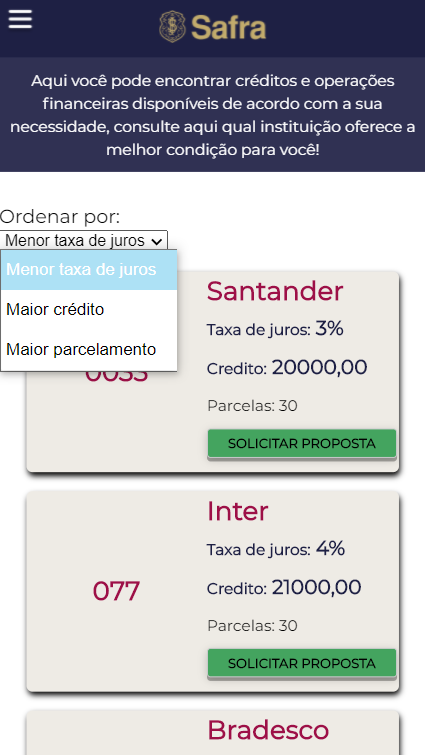
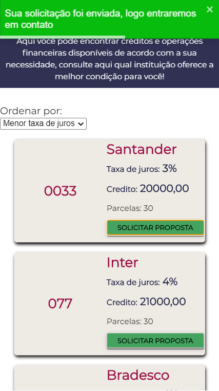
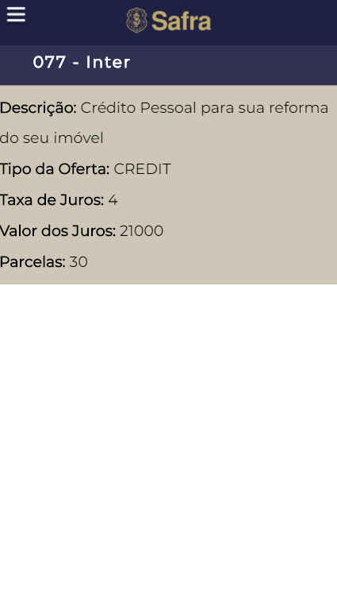

# Talent Fest 2020 - Safra Rendimentus

Para acessar a página [clique aqui]().

```sh
Login: jose.silva@email.com
Senha: 123456
```
## Índice

  - [1. Desafio Safra](#1-desafio-safra)
  - [2. Solução](#2-solução)
  - [3. Interface](#3-interface)
  - [4. Tecnologias](#4-tecnologias)

## 1. Desafio Safra

Esta aplicação foi desenvolvida durante o Talent Fest, evento no formato hackathon realizado ao final do bootcamp da Laboratória, onde as alunas desenvolvem aplicações propostas por empresas participantes ao longo de três dias. Este projeto foi proposto como desafio pelo Banco Safra.

Projeto **_Rendimentus_** para organização das suas contas e cartões. Em uma única plataforma, faça a gestão do seu dinheiro e conheça as ofertas de produtos e serviços disponíveis pelas instituições. Depois de conferir as ofertas e escolher aquelas que têm mais a ver com você e com seu momento de vida, através de um clique, você pode iniciar uma conversa com o time de atendimento da instituição para negociar as condições e adquirir o seu produto.

## 2. Solução

Para a solução do desafio nós criamos um **_DASHBOARD_**  baseadas nas necessidades do usuários em visualizar todas as contas  existentes de varias instituintes financeiras. Além de poder acessá-las e controlar seus gastos e obter soluções quando seu crédito for inferior a sua movimentara bancaria.

## 3. Interface

### Protótipo 

Por meio da ferramenta Figma, elaboramos nosso protótipo no modelo *mobile first* e design *responsive*


## 4. Densenvolvimento Front-end

### MVP

Esse é o resultado final da aplicação desenvolvida durante o **_Talent Fest_**



















## 5. Tecnologias e Ferramentas

 - JavaScript (ES6 +)
 - React
 - React Hooks
 - React Router Dom
 - React-toastify
 - Eslint
 - CSS3
 - Trello
 - Figma
  
## 6. Considerações técnicas

### Instalação e execução.

- [Clone](https://help.github.com/articles/cloning-a-repository/) o projeto na sua máquina executando o seguinte comando no seu terminal:

```sh
git clone (link-do-repositório)
```

- Instale as dependências do projeto com o comando:

```sh
yarn install
```

- Rode o projeto na sua máquina com:

```sh
npm start
```

- E visualize o projeto no seu navegador com o link:

```sh
http://localhost:3000
```

## 6. Implementações futuras        
          
Futuramente serão implementadas funcionalidades para melhoria da experiência do usuário:

- Bancos do cliente definido por cor especifica;
- Filtrar melhor proposta de crérito de acordo com o perfil do usúario
  
  ## 7. Autoria

Este projeto foi feito por [Alessandra Marinho](https://github.com/alessandramarinho),
  [Karine Sardela](https://github.com/kfsardela),
  [Mariana Barros](https://github.com/MarianaMBarros) e
  [Sabrina Martins](https://github.com/sabrina-aparecida), com base nos aprendizados desenvolvido ao longo do Bootcamp da [Laboratoria](https://github.com/Laboratoria).

## 8. Agradecimentos

- [Laboratoria](https://github.com/Laboratoria)
- [Safra](https://www.safra.com.br/)